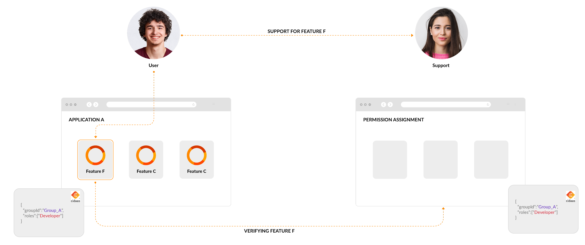

# Impersonation

### Origin of the Impersonation Term
Impersonation refers to the act of pretending to be someone else, typically with the intent to gain unauthorized access to information, resources, or to deceive or defraud other people. This concept is widely applicable in various contexts, such as social, legal, and technological environments. Here are some specific examples of impersonation:

In many cases, impersonation requires significant effort to mimic the speech, behavior, appearance, or digital signatures (like email addresses or domain names) of the targeted individual or entity. Preventative measures against impersonation often include multifactor authentication, education on phishing tactics, and strict verification processes in environments where identity is crucial to access control.

### Feature of Impersonation and its Intention
In the context of an identity and access management (IAM) system, impersonation is a legitimate and controlled feature that allows one user (usually an administrator or support personnel) to assume the identity of another user. This is done in order to perform tasks on behalf of the latter, without requiring their credentials. Here are some key intentions and uses of impersonation within an IAM system:

Intention | Description 
----------|------------
**Support and Troubleshooting** | Impersonation allows support staff to access a user's account to troubleshoot issues firsthand. This can be crucial for diagnosing problems that are specific to a user's account settings, preferences, or environment.
**Continue the business process**: |The support can continue to submit orders, add products to a basket, etc. So business related actions where a user is lacking skills to complete the business process.

**Safeguards and Best Practices**
To prevent abuse, the use of impersonation in an IAM system is typically surrounded by strict controls and best practices:

Impersonation poses a security risk. When user information is accessed or altered, it's crucial for log messages to clearly identify the individual responsible. If actions are performed directly by the user, identification is straightforward. However, if an administrator or support person carries out these actions, this must also be clearly indicated in the logs. Standard impersonation practices often fail to provide this distinction, making it difficult to determine if the actions were performed by the user themselves or by someone else on their behalf.

## Approaching Impersonation in Support Processes

We will construct two scenario:

<!--
type: tab
title: Feature is not working
-->

### Feature is not working

**Feature is not working**: As a user, you have specific permission (groups and roles), and a feature is not working.

**Reproduction of issues** can take place by using the permissions assigned to the user. This approach allows support or troubleshooting personnel to replicate the problem without needing direct access to the user's account. By receiving the same permissions, they can investigate and address the issue effectively.

**Limitation**: The setup makes it too difficult to achieve this e.g. The identity and access management provider allows to authenticate, but the underlying system might still manage further the permissions, more fine-grained permissions.

**Effectively assign** the same permissions in the underlying system to the user, or achieve that cidaas is providing access by mapping roles to the system.

**Audit Trail**: cidaas supports to assign groups and roles to a user. When the support team now assigns those permission to his own users, it will show up in the changelog, allowing a proper audit-trail. 

<!--
type: tab
title: Lacking Skills to perform Business Actions
-->

### A user is unable to use the system (skills)
**User wants to perform a business action**: A user wants to order a contract or add a product to the basket. It is solely due to the lack of skills or patience, that he is reaching out to the support, so they can help him.

:warning: For this use case you will not need impersonation, but a proper business process to support business actions.

#### Solution 1: Backoffice App / companion-app:
The companion app is [group/roles restricted](https://docs.cidaas.com/docs/cidaas-iam/q1hxpkemxxoc3-permission-management#grouprole-restriction), only allowing support personnel to access the app. This app provides further features, allowing to see the users resources and perform business actions.

#### Solution 2: Delegated Administration
The resources bound to the user are already formed like a group. It can be a family/friends group or household. And all underlying objects, like contracts, wishlists, interests etc. are available when being member of this group.

The advantage using a group structure is that you can easily establish consent processes using the [**Auth Manager**](https://docs.cidaas.com/docs/portals-and-dashboards/ihg0l7bjrdeya-auth-manager):

**Establish a consent process** that enables users to authorize administrators to view and perform specific actions on their resources. This process should include clear mechanisms for users to grant and manage permissions, ensuring they retain control over their data and actions taken on their behalf. The consent should be specific about what actions are permitted and should be logged meticulously to maintain a transparent record of all authorizations and activities.

Thereby the admin, can request approval from the GROUP_ADMIN of this group to be member of the group for a limited amount of time (*valid from*, *valid to*).

#### Solution 3: Additional Accesstoken Payload

In case you really would like to handle this feature for your support in the actual app, you can add a additional access token payload e.g. `imp_sub` that contains the sub of the impersonated user.

Please be aware the actual "sub" in the token, will still belong to your user. You will need one additional app, too, where you define this as additional access_token_payload. The user must set the "imp_sub" as customField for the customer service user. 

Ensure that this is only editable by admin, so not user could set this value. Furthermore we would recommend that the second app (used for impersonation features) is group-role-restricted, to ensure no unauthorized user can get this value in the token.
 
<!-- type: tab-end -->