# Requirements / Installation

- Installation of the plugin via upload
- Activate and configure under 'My extension'
- Store Client-ID & Secret as well as Url of the IDP
- Select standard customer group and enter a field for the customer number
- Customer group assignment is coming in the next version

# Prerequisite CustomFields

The address must be mapped via the **CustomFields**:

- Salutation : field name `salutation`

- country : field name `country`

- Street : field name `billing_address_street`

- City : field name `billing_address_city`

- Postcode : field name `billing_address_zipcode`

To know how create customFileds kindly refer [here](https://docs.cidaas.com/docs/cidaas-iam/9c8e30b5293a0-registration-fields-setup).

# cidaas Plugin for Shopware

The **cidaas plugin** for Shopware offers S**hopware end-user/customer-user** interface login using a **passwordless** or **social login** authorization method.

In this section,

- We will introduce you to the cidaas plugin for Shopware
- Demonstrate the steps to install the plugin and
- Login into the cidaas Shopware user interface
- Customer group assignment is coming in the next version

If you are here, we assume you are already using Shopware and would like to add the cidaas extension to your e-commerce website for authentication.

## Introduction

**cidaas Shopware plugin** is an Open Authorization (Oauth) plugin. The primary focus of this plugin is to provide Shopware login via **passwordless, classic, and social login cidaas authentication methods**.

The overall process includes:

- Downloading the "cidaas plugin for Shopware"
- Installing and activating the plugin
- Configuring the cidaas Admin Dashboard
- Creating an OAuth2 application for Shopware
- Selecting the required configurations in the cidaas OAuth2 Connect Configuration page.

### Steps to Install the Plugin

This installation will help you use cidaas login functionalities and authentication methods for user management on your website.

**1.** Download the **cidaas plugin** from the [**Shopware store**](https://www.cidaas.com/shopware-plugin/) or the **plugin manager** on your Shopware admin site.

**2.** Click on **Extension** from the **sidebar** menu.

- Select **My Extensions** from the drop-down list,
- Upload the **Shopware extension plugin**.
- Click on that Apps and install and activate the cidaas for the Shopware plugin.
- Activate the plugin for the configuration

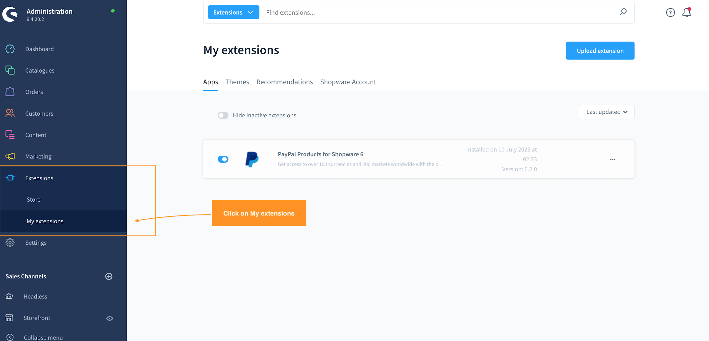

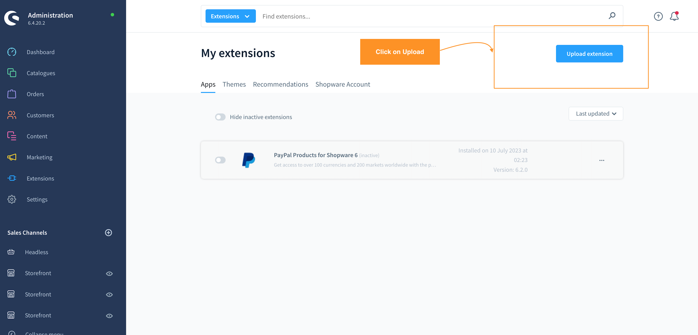

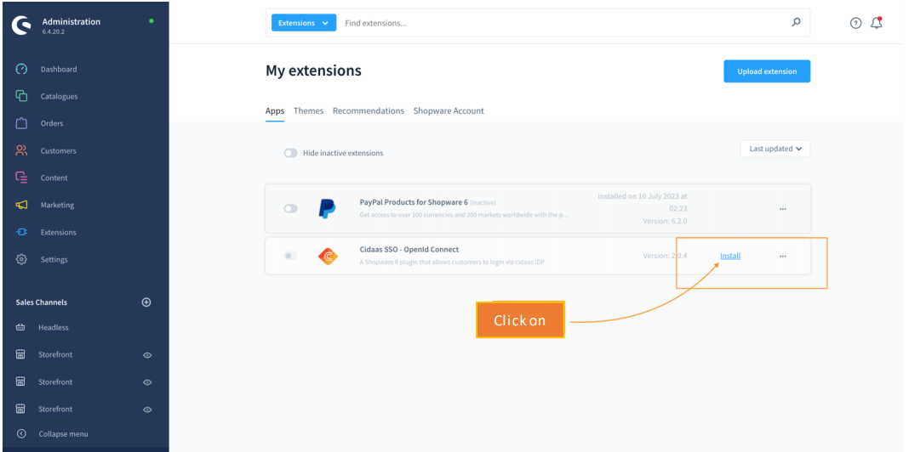

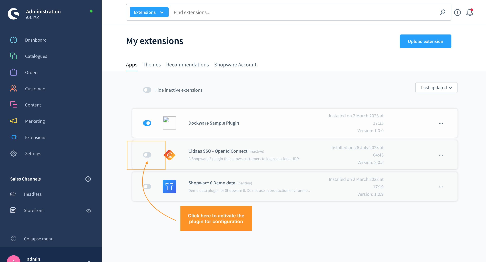

*Navigate to the cidaas admin dashboard and fill in the details of the **cidaas Plugin Config**.*

**Click [here](https://www.cidaas.com/pricing-packages/) to get your cidaas instance**

>
>**Note:** We required two cidaas application configuration for shopware plugin.
- cidaas Single page client application for Login, Register and get User profile functionality.
- cidaas Non-interactive client application for updating profile and Change email functionality.

2. Click on **App settings > Create a new app** to create an app (OAuth2 Client) in Shopware.

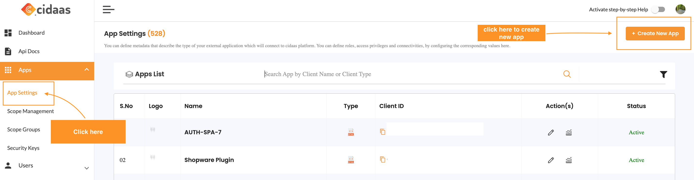

3. Fill in the app details and select Single page in App type and Click on Next.

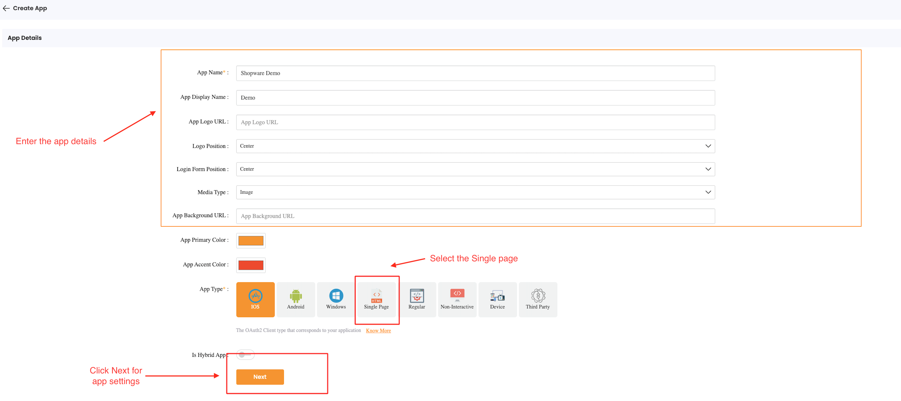

4. Fill in the app settings with the following details:

   - The scopes to be added include openid, email,roles,cidaas:register, and profile.
   - Set the value for Hosted Page Group as "default".
   - Set your domain names for Redirect and Logout URLs.
   - Click on Next

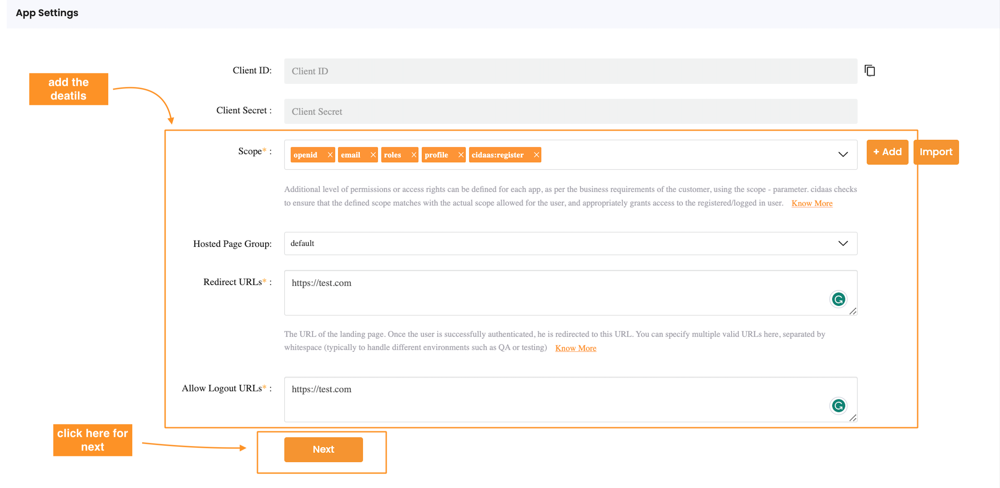

5. Fill in company details and click on save

>
>**Note:** You have successfully created your app, the next step is to add the registration fields for the app. For more cidaas Client Configuration please refer to our docs [link](https://docs.cidaas.com/docs/cidaas-iam/288aa0f48e2fc-app-management)

**To add registration fields**

6. Navigate to App settings and click on the edit icon of the newly created application.

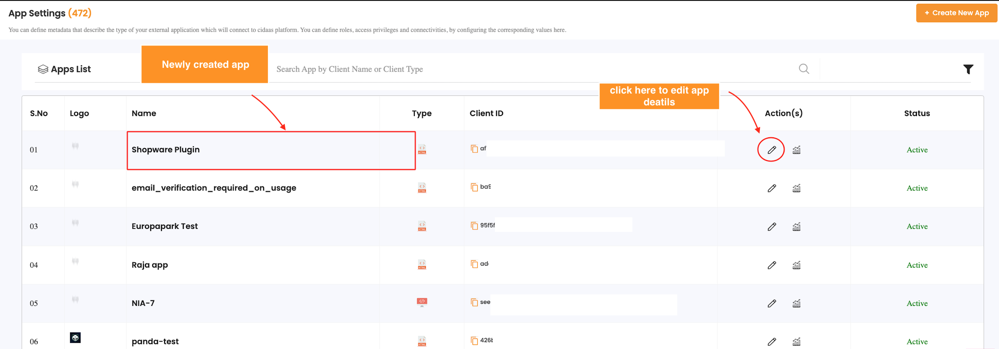

7. Scroll down to the company details section and click on Advance settings.

8. Go to the Registration field section and select the desired, allowed, and required registration fields.

Also, select feasible communication medium verification to verify the users.

In Shopware, the specified fields are essential components for managing customer information and processing orders. Each field serves a specific purpose in capturing and organizing relevant data. Here's a brief explanation of each field:

**Email:** This field is essential for creating unique user accounts and establishing communication with customers. It serves as a primary identifier and contact point for order confirmations, password recovery, and other important notifications.

**Given Name (First Name):** The given name field is used to store the customer's first name. This information personalizes the shopping experience and is often used in communications such as greetings and personalized messages.

**Family Name (Last Name):** Similar to the given name, the family name field is crucial for personalization and proper identification of customers. It is often used in formal communications and is an integral part of the customer's profile.

**Password:** The password field is necessary for securing customer accounts and protecting sensitive information. It ensures that only authorized users can access their accounts and make purchases. It is crucial to enforce password policies to enhance security.

**Password Echo (Password Confirmation):** This field is used to confirm the password entered by the user during the registration or password change process. It helps prevent errors and ensures that the customer has entered the correct password by requiring them to confirm it.

**billing_address_street:**

- **Definition:** This field captures the street address of the customer's billing information.
- **Purpose:** It is crucial for generating accurate invoices and ensuring the correct delivery of physical goods.

**billing_address_city:**

- **Definition:** This field captures the city of the customer's billing address.
- **Purpose:** Helps in identifying the customer's location for taxation purposes and provides essential information for shipping.

**salutation:**

- **Definition:** This field captures the salutation or title (e.g., Mr., Mrs., Dr.) associated with the customer.
- **Purpose:** Adds a personal touch to communications and is often used for formal addressing in documentation.

**country:**

- **Definition:** This field captures the customer's country information.
- **Purpose:** Necessary for determining applicable taxes, shipping costs, and complying with regional regulations.

**billing_address_zipcode:**

- **Definition:** This field captures the postal code or ZIP code of the customer's billing address.
- **Purpose:** Essential for precise location identification, shipping calculations, and compliance with postal regulations.

**company_name:**

- **Definition:** The "company_name" field in Shopware is a data container designated for storing the name of the company associated with a specific entity, such as a customer or business account.
- **Purpose :** The purpose of the "company_name" field is to accurately identify and associate the respective company information within the Shopware system

To guarantee a seamless customer experience and ensure accurate order processing in Shopware, it is essential to create these fields in the cidaas system and set them as mandatory.

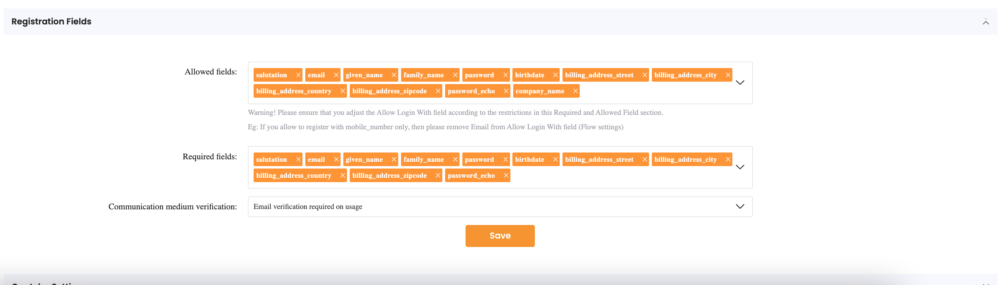

Kindly check [here](https://docs.cidaas.com/docs/cidaas-iam/e8ce45afc47ba-user-field-settings) for more information on registration fields.

1. Create the Non-interactive app with the following details:

The scopes to be added include only `cidaas:users_write`.
Click on Next
Fill in company details and click on save

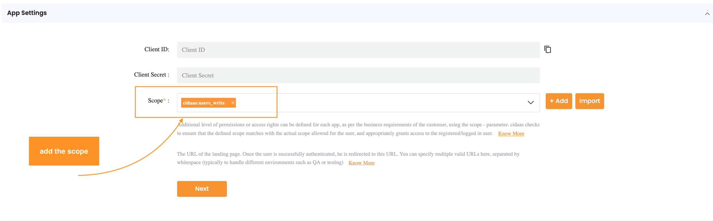

10. Next, you need to copy the below details to configure the cidaas into shopware.

    - **Navigate** to App settings.
    - Copy the **Client ID, Client Secret** of both Single page and Non-interactive applications
    - Base URL endpoint will be your Domain URL example- https://your_domain.de

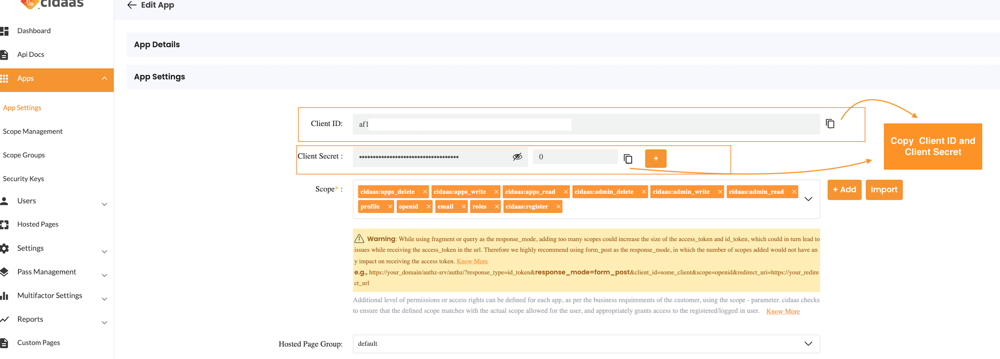

11. Navigate to the **Shopware dashboard > Extensions > My extensions > My plugin > click on configure**.

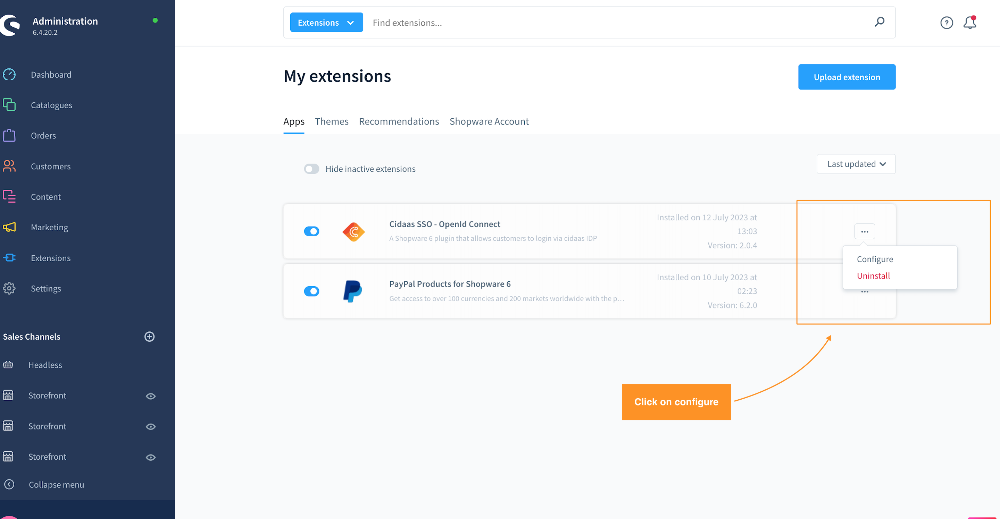

12. Enter the details on **cidaas OAuth2 Connect Configuration page**. Select Sales Channel, provide values for the fields, and **Save**.

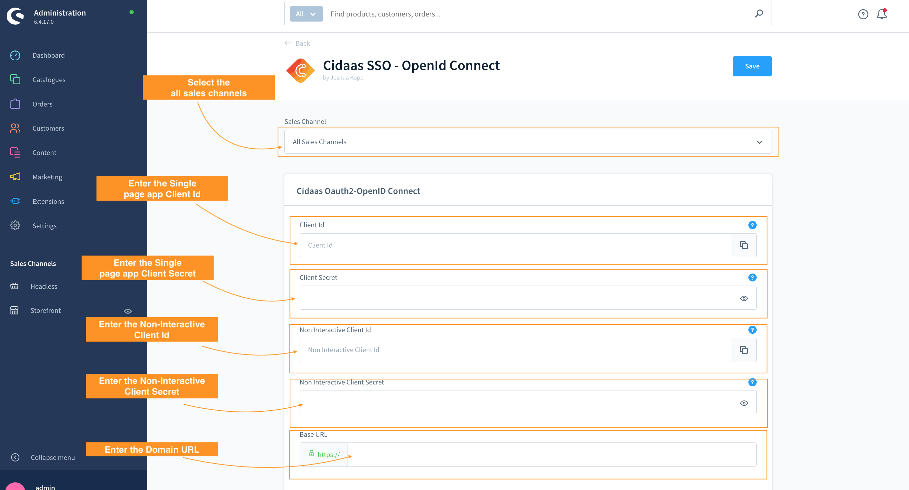

13. Once the plugin is active, the **login with cidaas button** will appear on your store end user login page. Your **customer-user/end-user** can now **login with cidaas**.

>
>**Note:** In a new user instance, a first-time customer-user/end-user has to create an account and register by filling in the details.

**For cidaas Client Configuration please refer to our docs [link](https://cidaas.stoplight.io/docs/cidaas-iam/branches/master/288aa0f48e2fc-app-management)**

### How does Shopware synchronize data with cidaas?

The process begins with the application initiating an OAuth flow, prompting the user to authorize a request. Within this process, the client includes the OpenID Connect scope along with scopes for any additional user information needed.

Upon processing the request, the client receives both an access token and an ID token issued by cidaas (the authorization server). This ID token contains claims with user information, facilitating a seamless Single Sign-On (SSO) experience by delivering the ID token from cidaas to the client. Subsequently, the client can contact a specific endpoint on cidaas, known as the UserInfo endpoint, to obtain the remaining claims about the user.

During login, if any of the aforementioned fields are missing for a user, the system redirects to the "register_additional_info" page to add those missing details.

The user info includes data such as sub, given_name, family_name, salutation, company, email, billing_address_street, billing_address_zipcode, and billing_address_city.

To determine whether the cidaas user exists in Shopware, we store the "sub" parameter in the Shopware database under the customfields object.

After login, the system retrieves the user data and checks if the user exists in the Shopware database using the unique Sub parameter. If the user exists, the user info data is updated with the corresponding Shopware data, such as address and customer details. If the user doesn't exist, the system performs an upsert and maps the cidaas user data to Shopware with the specified format.

In the Shopware storefront, when the user updates their profile and address, the system concurrently updates the same data in cidaas using the cidaas update user API endpoint.

**Profile data update from Shopware to cidaas**

- Email
- Password
- First Name
- Last Name
- Salutation

**Address data update from Shopware to cidaas (only Billing address is stored in cidaas)**

- billing_address_street
- billing_address_zipcode
- billing_address_city
- company
- billing_address_country

<!-- theme: warning -->

> ### Need Support?
>
> Please contact us directly on our [support page](https://support.cidaas.com/en/support/home)

