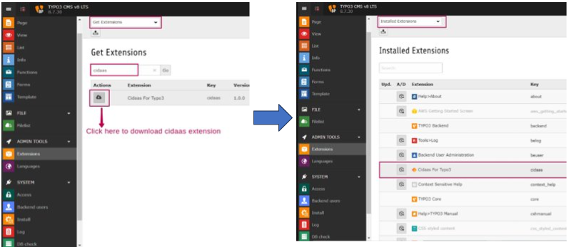
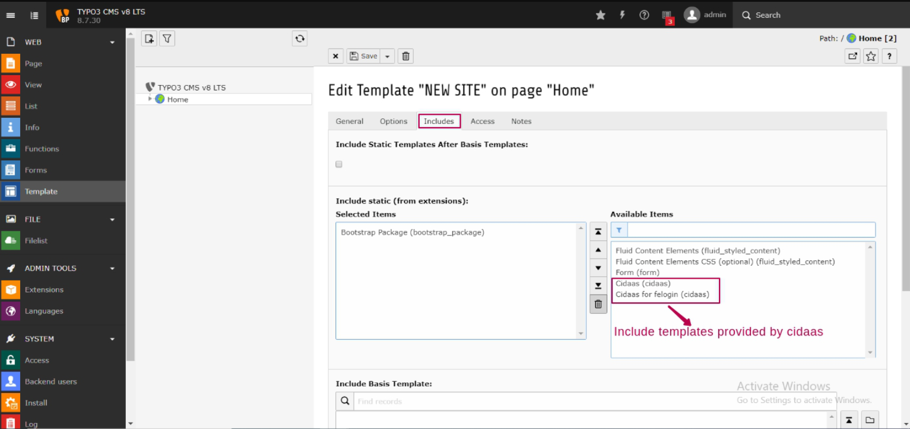
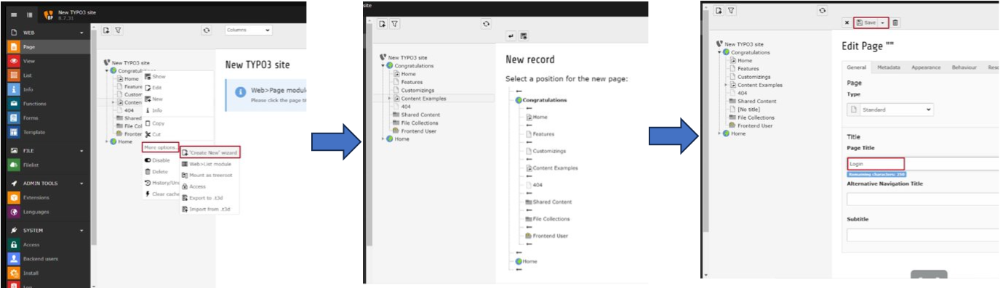
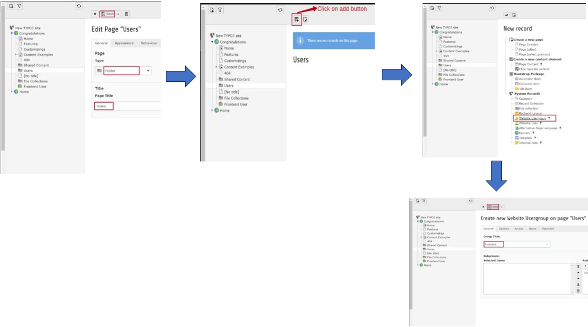
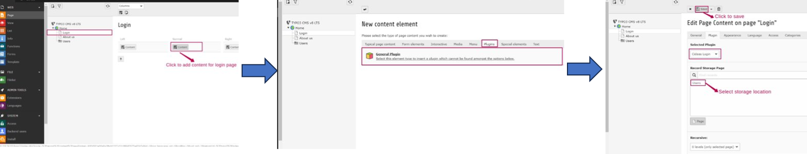
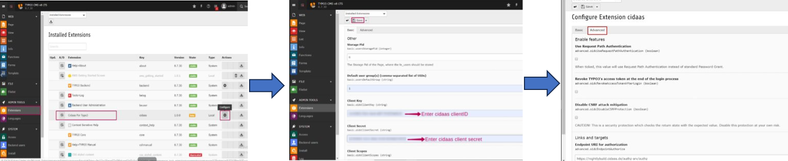
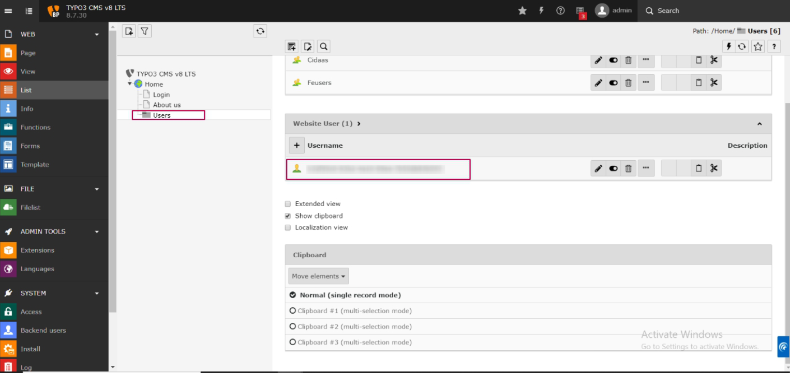

#  cidaas for Typo3
cidaas provides an extension that is deployed in the Typo3 marketplace and can be configured and used by Typo3 users.

This article will help you integrate the **cidaas extension for Typo3**.

>
>Install the [*Typo3*](https://docs.typo3.org/m/typo3/tutorial-getting-started/main/en-us/Installation/Index.html). 

In a nutshell, these are the steps:
- **Create a cidaas app**
- **Activating the cidaas plugin**
- **Include cidaas templates**
- **Create a login page and user page** (if not already present).
- **Add the cidaas plugin to the login page**
- **Configure the cidaas extension**
- **Verify your configuration**

## Create a cidaas app

Creating an app will help you get a unique app for Typo3 with its **Client ID** and **Client secret**.

**You can create an app by following our [documentation](https://docs.cidaas.com/docs/cidaas-iam/wmnklc5ipzj98-angular-app) or [academy video](https://academy.cidaas.com/index.php/courses/cidaas-basics/).**

## Activating the cidaas plugin

This section will help you configure **cidaas as a login** to your Typo3 application so that you can use all the cidaas login functionalities and authentication methods for user management.

1. Login to your Typo3 admin panel.
2. Select **Extensions** from the left menu. Choose **Get Extensions** from the dropdown.

   - Search for the **cidaas extension** and  download it.
3. Choose **Installed Extensions** from the dropdown. Check for **cidaas for Typo3**.

## Include cidaas templates

This section will help you include the required templates for cidaas for the Typo3 extension.

1. Login to your Typo3 admin panel.

2. Select the **Templates** section in the left menu and click on the **Edit the Whole Record**.

3. Select the **Includes** tab. Choose the templates provided by cidaas, i.e  **cidaas(cidaas)** and **cidaas for felogin(cidaas)** by searching them in **Available items**.

## Create a login page and user page

### Create login page

1. Navigate to root page of your typo3 project and **right click > More options > Create new wizard**.

2. Select the position where the page needs to be created.
3. Give it a suitable **title** and click on **Save**.

### Create user page

1. Follow the **step 1** and **step 2** of **Create login page**.
2. Select page Type as **Folder**, enter title as **Users** and click on **Save**.
3. Now click on the newly created **Users folder** > **Add button**.
4. Select **Website Usergroup**> Enter a suitable name > **Save** .

## Add the cidaas plugin to the login page

In this section, we will guide you through configuring the cidaas plugin as a content on your login page.

1. Navigate to the **Home page** and select **Page**.  Go to your login page to add **select content** and click on **Add content**.

2. Under the **Plugins tab** > **General Plugin**.

3. Select **cidaas Login** option from the selected Plugin dropdown, available under the **Plugin** tab and then select the storage location and **save**.

## Configure the cidaas extension

Now we will configure **cidaas for Typo3** extension with your client id and client secret, which are obtained from your cidaas application.

1. Navigate to the **Home page** and select **Extensions**. Choose **cidaas for Typo3** > **Configure**.

2.  Fill all the required details, such as **client id**, **client secret**, and **scopes** under basic, related **endpoints** under **Advanced**, and **Save**.

We are now done with the setup, and you can verify your configuration.

## Verifying your configuration

1. Run your **Typo3** application.
2. Click on the **Login** button.
3. You will now be redirected to the **cidaas login page**, and you can perform the authentication with the help of cidaas.

   - After successful login, Navigate to your **Typo3** > **List** > **Users page**,where you will find the Website user section, which contains the details of the logged-in user.

<!-- theme: warning -->
> ### Need Support?
> Please contact us directly on our [support page](https://support.cidaas.com/en/support/home)
>

