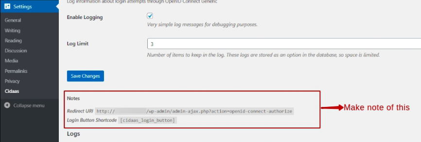
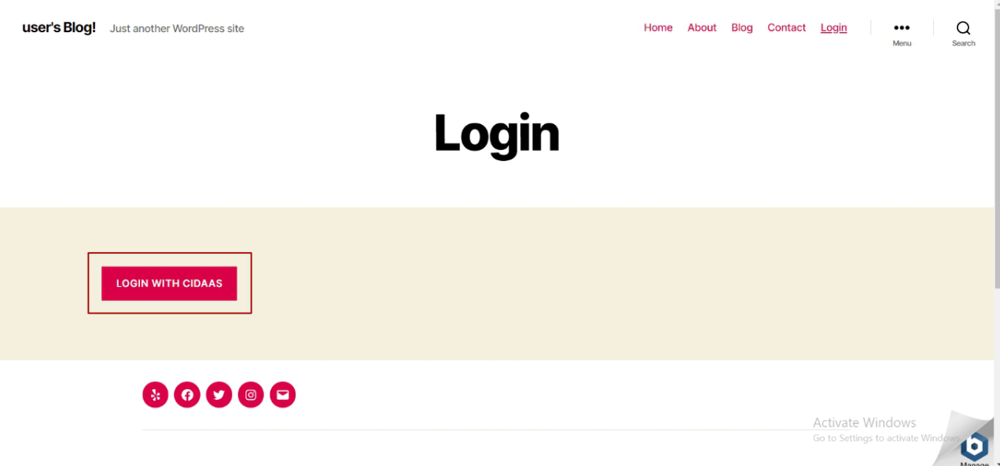

#  cidaas for WordPress

cidaas provides a plugin that is deployed in the WordPress marketplace and can be configured and used by WordPress users.

This article will help you integrate **cidaas plugin into your WordPress application**.

>
>Install the [*WorldPress*](https://developer.wordpress.org/advanced-administration/before-install/howto-install/). 

In a nutshell these are the steps:

- **Create a cidaas app**
- **Activating the cidaas plugin**
- **Configure cidaas endpoints.**
- **Create login page and configure**
- **Verify your configuration**

## Create an cidaas app

Creating an app will help you get a unique app for WorldPress with its **Client ID** and **Client secret**.

**You can create an app by following our [documentation](https://docs.cidaas.com/docs/cidaas-iam/wmnklc5ipzj98-angular-app) or [academy video](https://academy.cidaas.com/index.php/courses/cidaas-basics/).**

## Activating cidaas plugin

This section will help you configure **cidaas as a login** to your worldPress application so that you can use all the cidaas login functionalities and authentication methods for user management.

1. Login to your WordPress admin panel.

2. Select the **Plugins menu** and click on **Add new**.

3. Search for **Login using cidaas** in the search bar and click on **Install Now**.

4. Click on **Activate**.

## Configure cidaas endpoints

The next step is to integrate **cidaas endpoints** so that **Login with cidaas plugins** is configured.

1. Select **Settings** and click on **cidaas**.
2. Enter the following fields.

> Copy the **redirect URI** and **login button short code** before **saving**.

3. Click on **Save**.

## Create Login Page and configure

Now you need to create a **login page** to show the **Login with cidaas button** on it.

Then we can link this newly created login page to your WordPress top menu bar for quick access.

1. Select the **Pages** menu on the sidebar and click on  **Add New**.

2. Provide the suitable **title** and paste the **login shortcut** saved from the previous section on your page.

### Adding Page to the menu (configure)

These steps will help you link your newly created page in the top menu of your WordPress interface.

1. Select the **Appearance** menu on the sidebar and click on **Menus**.

2. Under the **Add menu items** section, select the recently created **login page** and click on the **Add to Menu button**. 

3. Click on **Save Menu** .

## Verifying your Configuration

1. Run your **WordPress** application.
2. Click on **Login** menu.
3. Click on **Login with cidaas** button.

4. You will now be redirected to the **cidaas login page**, and you can perform the authentication with the help of cidaas.

<!-- theme: warning -->
> ### Need Support?
> Please contact us directly on our [support page](https://support.cidaas.com/en/support/home)
>

