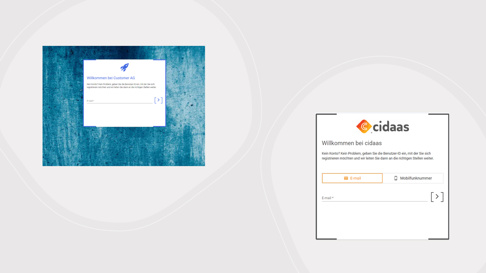

<!--
focus: false
-->

# Integrating cidaas with your business

cidaas can be integrated into almost any system landscape. Integrating with your business is simple and can be done for a various of different use cases. Besides the features which will mostly appear on the login and registration pages like passwordless login, multifactor authentification, progressive registration or social login, there are a lot of *backend* functionalities like fraud detection, event processing, reporting and much more.

**Get all of cidaas' power while integrating it into your systems.**

<!--
focus: false
width: 700px
-->

<!--
type: tab
title: Business-, Mobile- and Web Apps
-->

## Business-, Mobile- and Web Apps

The most common use case for cidaas is to provide *single sign on*. Login once and grant access to different applications. cidaas based on the oauth2 and OIDC standard, which provide an easy and secure way to integrate it in your business applications. No oauth/OIDC - no problem: we also support SAML or find a custom solution with you.

Login and registration are handled on centralized page to separate user credentials from business applications. These pages could be specific to an app, channel or can be designed uniformly to strengthen high recognition and the feeling of familiarity. Changes in login or registration process can appear in every application very fast and with less effort.

> benefits
>
> - single sign on - **SSO**
> - unified login- and registration mechanism
> - separate user credentials from business
> - adapt login & registration flows quite fast and easy
> - group and role restrictions

<!--
type: tab
title: Application specific Backends
-->

## Application specific Backends

One target of the integration of cidaas should be to build up a centralized master user identity, which will be used by all your applications. However, there could be cases with legacy system or architectural reasons, where we need to share user data with application backends. In that case cidaas should always be master, updates in application must be also send to cidaas.

> benefits
>
>- link identity to application data
>- share identity data to further systems
>- support legacy systems

<!--
type: tab
title: Customer Relationship Management
-->

## Customer Relationship Management

Order history, payment data or extended product specific user data are stored in a CRM system and shouldn't store in cidaas. cidaas create a unique identifier (*sub*) for each account. The sub should be linked the identity in CRM.

cidaas sends different events like *user create*, *user update* and *user delete* to notify the CRM for updates.

> benefits
>
> - link identity to business data (order data)
> - separate user data and personalized business data

<!--
type: tab
title: Marketing Tools
-->

## Marketing Tools

cidaas sends mails by default via a system provider. Templates, sender configuration (like sender name) and volume can be configured. Nevertheless, it could make sense to reuse existing tools to have centralized email templates - registration/login related, newsletter or other marketing mails.

> benefits
>
>- send emails and sms through your known and familiar marketing tool
>- manage newsletter consents during registration or in user profile

<!--
type: tab
title: Reporting Tools
-->

## Reporting Tools

*Number of users*, *number of logins* or *number of registrations* are helpful reports for multiple departments in your company, e.g. to measure the success of a marketing campaign. cidaas provides those reports and will expand report functionalities in future. We get some requests for custom specific reports which are not part of the product. To cover all of them cidaas provides around 100 different webhook-events, which can send information to your reporting tool to generate you own reports.

> benefits
>
>- real-time reporting
>- customer specific, independent reporting

<!-- type: tab-end -->

<!--
focus: false
-->

