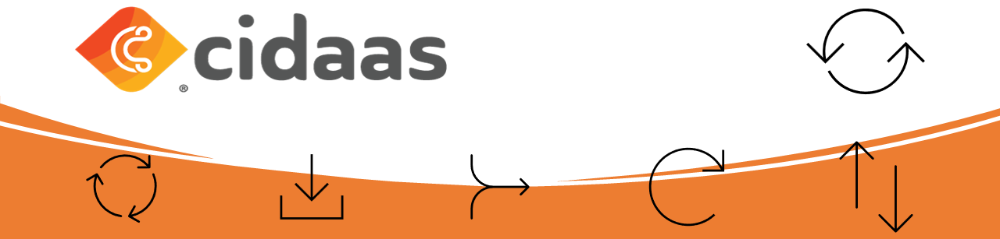
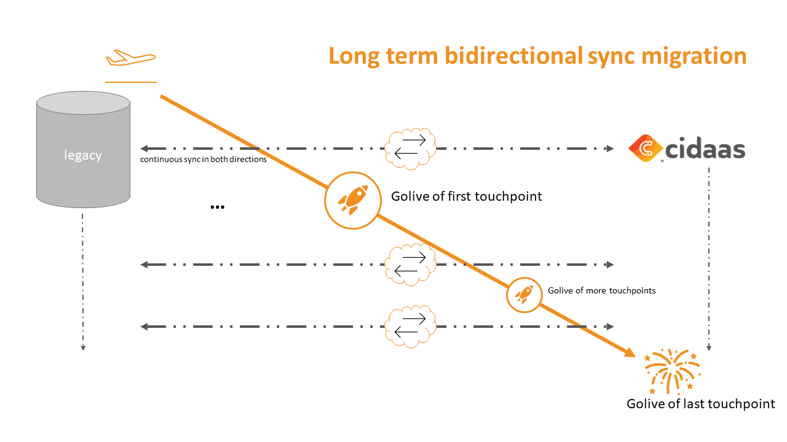

<!--
focus: false
-->

# Long term bidirectional migration via event stream

When we are talking about a long term bidirectional migration via event streams, we are referring to a scenario where data from the legacy system is synced to cidaas and from cidaas to the legacy system. This scenario is usually running for a few weeks. This approach is the preferred one in case that 
- the amount of user data is quite high *> 500k user*
- that multiple apps (webshops, mobile apps, websites...) cannot be migrated at the same time
- authentication against the legacy and cidaas system should be possible at the same time

Here we can make sure, that updates which are happening in the legacy system are populated in real time to cidaas and the other way around. This scenario is interesting for all customers who want to migrate from the legacy system to cidaas, but who are not able to go-live with all applications at the same time. This means that the switch can start by for example only to a go-live with the webshop, which uses cidaas for the authentification. All other applications like mobile apps, will remain to authenticate against the legacy system.

## How is this possible?

During the migration phase we will create a setup, which allows us to keep the data in cidaas and the legacy system in sync. This means all data of the user accounts like email, given_name, family_name and as even the password (better: password hashes) will be synchronized in case of any event, either triggered by cidaas or the legacy system. To understand this more clearly, we will take a look at the next graph:

<!--
focus: false
width: 700px
-->

On the left hand side, we see the legacy system, a custom wrapper in the middle and on the right hand side cidaas.
Right at the beginning there will be a setup of the bidirectional sync between both systems. Therefore, as a precondition it is mandatory, that the legacy system can generate events for the changed data. E.g., if user changes his email or password, the legacy system should be able to inform about this change and deliver the data necessary to update the data in cidaas. If the legacy system is able to create this data, the magic of the mapping will happen in a custom wrapper. 

## What is a custom wrapper?

The responsibility of the custom wrapper is, to map the data of both systems, the legacy one and cidaas. Let’s say, the legacy system uses the field key "first_name" for the given name and in cidaas is uses the key "given_name". The custom wrapper will now take the data from both sources and map it to the correct key, depening, who should receive this. In general, cidaas will provide the events via webhooks, which can easily be consumed with a REST endpoint. The data itself from cidaas can then be accessed by using the sub from the webhook and using a token from a client_credentials app. Note: the data is not included in the webhook, to not extend the size of those too much, but the user can always be identified by the unique sub.

Hint: Since in those scenarios many data is being consumed, it is highly recommended to add some messaging queue in between, which can handle incoming messages.

After sync is in place, the first application can be moved to cidaas. By this the first app will now be switched to authenticate against cidaas, but the remaining apps will still authenticate against the legacy system. After this was successful, the apps will be moved from time to time to cidaas. During this time the user will be able to login against both IDP's with the same credentials.

Now after the last application is switched, the sync can be stopped and the full feature set of cidaas can be used in live mode!

# Technical implementation

For the technical implementation cidaas does provide a REST API which can handle batches of users (max. 50 users). The API can be used by using following path: customerdomain/users-srv/user/bulk. In optimal case the users will be added in sizes auf 25-50 users and if there are more users to be migrated at once, the users should be added in some sort of messaging queue. By this you can make sure, that no users are getting lost during the sync and all are getting processed. 

The Migration-API itself is documented below:

API | Description | Link to API
---------|----------|---------
 Migrate (add or update) user entities | This API helps to migrate users and, if applicable, their hashed passwords. | [Link](https://docs.cidaas.com/docs/integration-doc/a20291b88d28a-migrate-add-or-update-user-entities) 

<!--
theme: info
-->
> **Important note**
>
> The API itself is secured by the scope "cidaas:bulk_user_create". If you wish to use this API, please contact support@cidaas.com so that the cidaas team will enable the migration mode including the scope for you.

