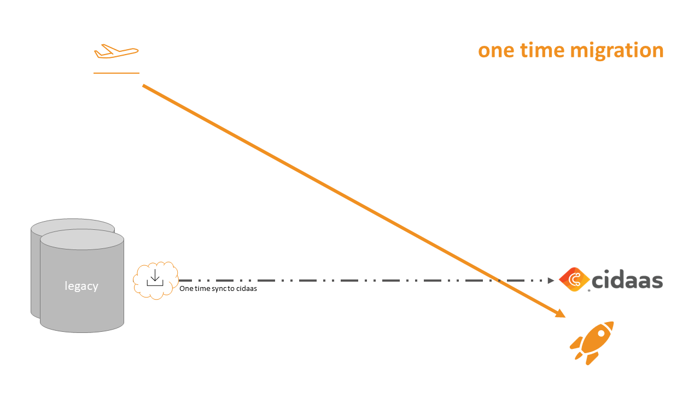

<!--
focus: false
-->

# One time migration via script

This approach can be used if the amount of data is quite less *< 10k user*, during GO-live the system can be switched to a maintenance-mode (small "downtime") and you decide to switch to cidaas with all applications at once. 

In the one time migration mode we mostly use a script based solution. For very small instances it could be a csv-importer or something similar.

The script could also be implemented as a create or update script, so you can run the script multiple times without any issues. If the amount of users is medium sized it might make sense to do a full migration a few days before the GO-live and a delta sync of only a subset shortly before the GO-live. By this the risk of data deriviations between both system can be lowered to a minimum.

<!--
theme: info
-->
> **Why do we need a downtime?**
>
> Technically we don't need a downtime to switch to cidaas, but if we use the one time migration we will not migrate data which will be added, changed or deleted between the export of the old system and the import to cidaas. To avoid missing data we need to block changes in the old system.

As you can see in the graph the data will be synced once in a bulk to cidaas and after that, the switch to cidaas can take place.

<!--
focus: false
width: 700px
-->

# Technical implementation

For the technical implementation cidaas does provide a REST API which can handle batches of users (max. 50 users). The API can be used by using following path: customerdomain/users-srv/user/bulk. In optimal case the users will be added in sizes auf 25-50 users and if there are more users to be migrated at once, the users should be added in some sort of messaging queue. By this you can make sure, that no users are getting lost during the sync and all are getting processed.

The Migration-API itself is documented below:

API | Description | Link to API
---------|----------|---------
 Migrate (add or update) user entities | This API helps to migrate users and, if applicable, their hashed passwords. | [Link](https://docs.cidaas.com/docs/integration-doc/a20291b88d28a-migrate-add-or-update-user-entities)

<!--
theme: info
-->
> **Important note**
>
> The API itself is secured by the scope "cidaas:bulk_user_create". If you wish to use this API, please contact support@cidaas.com so that the cidaas team will enable the migration mode including the scope for you.
