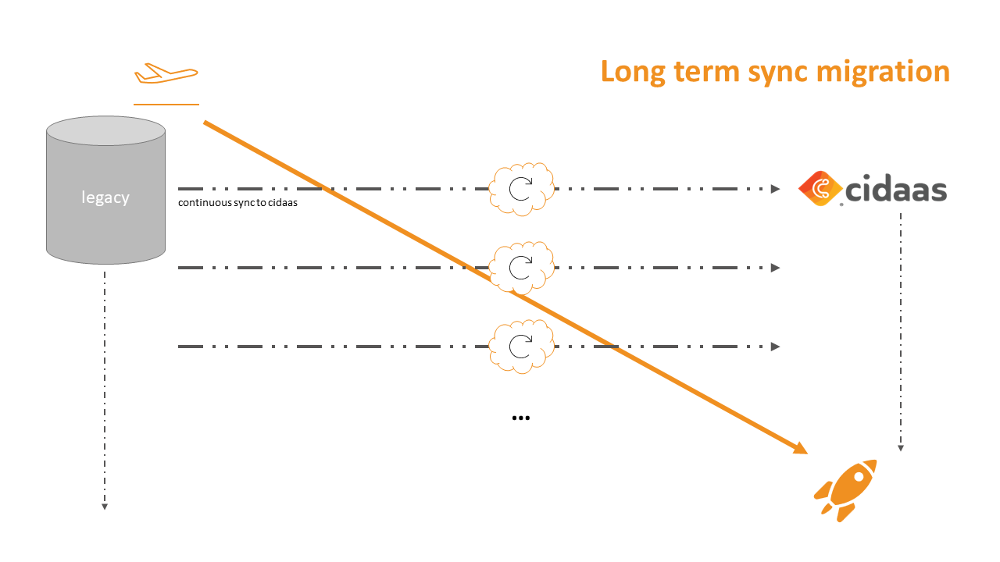

<!--
focus: false
-->

# Long term migration via event stream

When we are talking about a long-term migration via event streams, we are referring to a scenario where data from the legacy system is synced to cidaas in a unidirectional way for a few weeks. This approach is the preferred one in case that:
- the amount of user data is quite high *> 500k user*
- that multiple apps at the same time should be migrated (webshops, mobile apps, websites...)

Here we can make sure, that updates which are happening in the legacy system are populated in real-time to cidaas. This is especially relevant for user related events like "email_changed" or "password_changed". In case a user changes his password, this event will be pushed to cidaas, where we can make sure, that the password is always the latest one.

In the following graph you can see the general flow:

<!--
focus: false 
width: 700px
-->

As you can see in the connection between both systems, the data will be synced continuously from the legacy system to cidaas. This can include different events like:
- User created 
- User updated
- User deleted
By this we can make sure, that also only existing users are getting migrated. 

Over the defined timeframe (e.g., 6 weeks) the full user data will be synced for defined events. Within this data we can include a lot of different default and custom data like:
- user data (e.g., email, given_name, family_name)
- password hash (e.g., bcrypt 12)
- mfa methods (e.g., TOTP setup)

Additionally, there might be the consideration to sync also other data than user data to cidaas like clients, social logins providers. But this depends on the exact use case. Most of the other data can be migrated at once since this data is not changing frequently.

After all of this data got migrated, we are ready to Go-Live with cidaas. There we have few considerations to make for the Go-Live:
- Add CName in cidaas: this is required if the same domain should be used after the switch. E.g., accounts.customer.com. Other solution would be to add already beforehand by using different domain like login.customer.com
- DNS switch: this is required in case that the same domain should be used after the switch.

During GO-live the system can be switched to a maintenance-mode (small "downtime") and you decide to switch to cidaas with all applications at once. Downtime in this case is not needed for all scenarios, but might be preferred in case that some applications take little longer to switch or a DNS switch is required.

Now after everything is switched, the sync can be stopped and the full feature set of cidaas can be used in live mode!

# Technical implementation

For the technical implementation cidaas does provide a REST API which can handle batches of users (max. 50 users). The API can be used by using following path: customerdomain/users-srv/user/bulk. In optimal case the users will be added in sizes auf 25-50 users and if there are more users to be migrated at once, the users should be added in some sort of messaging queue. By this you can make sure, that no users are getting lost during the sync and all are getting processed. 

The Migration-API itself is documented below:

API | Description | Link to API
---------|----------|---------
 Migrate (add or update) user entities | This API helps to migrate users and, if applicable, their hashed passwords. | [Link](https://docs.cidaas.com/docs/integration-doc/a20291b88d28a-migrate-add-or-update-user-entities)

<!--
theme: info
-->
> **Important note**
>
> The API itself is secured by the scope "cidaas:bulk_user_create". If you wish to use this API, please contact support@cidaas.com so that the cidaas team will enable the migration mode including the scope for you.
