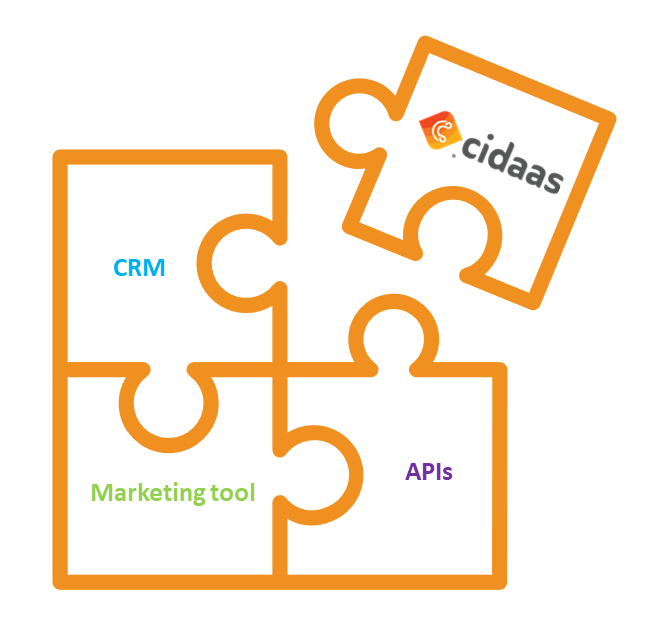

# Roadmap to integrate cidaas

<!--
focus: false
-->

Integrating cidaas to your business could be done by your own, supported by us or together with one of our partners. In addition to supporting the standards **oauth**, **OIDC**, **SAML** and **Kantara** we follow the *everything is an API* Approach.

After the decision to go with cidaas, there will be some questions to answer.

- How should the GO-live look like?
- Which system(s) you want to connect to cidaas from the start and which after GO-live?
- Do you have to migrate any data?
- How should authentification be displayed to the customer?
- Which data needs to be shared to other systems?

<!--
theme: success
-->
> The all-time fastest cidaas integration was in less than 1 single day, including sales contact, instance setup, add cidaas as login provider to customer portals and GO-live.

While conception phase you should be able to answer all of these questions. Combined all questions take impact on 4 categories **Data migration**, **Integration of applications**, **Integration of backend systems** and **GO-live**. 

## GO-live

Let's start with GO-live planning. It has a big impact on further decisions. Question 1 & 2 includes the question if you want to GO-live with all applications at the same time (*all-in-one*) or would you like to migrate app per app (*step-by-step*).

**step-by-step**

App per app could mean that we will have two different systems in parallel which need to synchronize permanently (e.g., user changed his password in system A which link to app A, afterwards he wants to login to app B which is connected to system B - expectation should be: user is able to use his new password)

> benefits
>
> - smaller working package for GO-live
> - possible necessary adaptation to certain systems can be planned longer
> - less risk while focusing on one app

**all-in-one**

If you choose all-in-one, you won't have to worry about synchronization or system compatibility. After GO-live that old system can be dismantled and the whole system landscape profits immediately from cidaas.

> benefits
>
> - no dependency to legacy system
> - less maintenance and operating effort
> - no complex sync architecture

**timing**

Another question regarding the GO-live is when the system is used the least or if there are even phases where it couldn't be available at all.

<!--
theme: warning
-->
> The target should be ever to lose no data and to have the least downtime

Here are some examples how the GO-live should look like.

<!--
type: tab
title: Small
-->
- **Users to migrate:** 500
- **System usage:** 8h/5d normal business hours
- **migration mode:** all in one

GO-live can be easily planned on a weekend.

**ToDos at GO-live**

- Export all users from the old system
- Import the users to cidaas via script
- Deploy new versions of apps

<!--
type: tab
title: Medium
-->
- **Users to migrate:** 10.000
- **System usage:** 24/7
- **migration mode:** all-in-one

Exporting and importing more than 10k users needs some time. That means we could lose data which will update during export and import. In this environment we should use a long term sync from the old system to cidaas. The sync will handle creates, updates and deletions of data. Before the GO-live cidaas will be available in public via e.g. *https://customer-prod.cidaas.eu*. You can also run a full integration test against this URL in advance.

**ToDos at GO-live**

- add cname in cidaas (e.g., *https://accounts.customer.com*)
- DNS switch

<!--
type: tab
title: Big
-->
- **Users to migrate:** 40.000.000
- **System usage:** 24/7
- **migration mode:** step-by-step

During a step-by-step migration both systems need to be in sync permanently. Before the GO-live cidaas will be available in public via new defined url e.g., *https://accounts.customer.com*. You can also run a full integration test against this URL in advance.

**ToDos at GO-live**

- release specific apps

<!-- type: tab-end -->

## Data migration

If you start on a greenfield you could skip this section ;)

Data migration mostly means user migration, but if you migrate from another oauth/OIDC solution also app-settings could be interesting. Do you have an existing consent-management? Should consents be migrated as well? Do you want that users remain logged in -> Migration of tokens and session?

At this point we guess you have an answer for question 3. That automatically leads to the question *How to migrate data to cidaas*, we suggest 3 different ways to migrate depending on 

- Amount of data
- GO-live approach - *all-in-one* or *step-by-step*
- expected downtime during GO-live

Our suggestions are based on our experiences and use cases in past. You are open to follow other suggestion or define a best match together with us or a partner.

- [One time migration](migration/one_time_migration.md)
- [Long term sync](migration/sync_migration.md)
- [Bidirectional long term sync](migration/bidirectional_sync_migration.md)

## Integration of applications

Connecting your applications to cidaas is based on OIDC and oauth. We provide different SDKs and plugins to make the integration as simple as possible - you can find them in [GitHub](https://github.com/Cidaas).

To find the best flow for your application, we recommend using following overview.

<!--
focus: false
width: 700px
-->

We describe the flows in detail in our [documentation](https://docs.cidaas.com/docs/cidaas-iam/7t3k9xc18627z-o-auth2-flows)
- PKCE
- Device Code Flow
- Client credentials

<!-- theme: info -->

> Other flows which are mentioned in OIDC and oauth are possible and maybe needed for third party systems, but wherever it is possible we recommend using one of the 3 above mentioned.

If you newly integrate an oauth/oidc based CIAM, you will also have some changes for login and registration. One part is to separate login-forms from the business application to a standalone approach. In cidaas we call it hosted pages.

In this section we will focus on question 4 *How should authentification display to the customer?*. cidaas provides a default set on hosted pages which can be customized up to a certain level. Logo, appname, colors, background and some more can be changed via configuration. Changes beyond that can be implemented and hosted by your own; gladly also based on our template.

Hosted pages include around 20 pages for login, registration, password forgotten, progressive registration, mfa and much more. Depending on the behavior in the system cidaas calls the corresponding page. With progressive registration your app prompts the user for basic information on the registration page. If another app requests more information additional information page will show and gather more data from the users.

<!--
focus: false
-->

<!-- TODO: fix the broken link -->
In our Best Practices chapter we created an entry for conception of hosted pages. Before you start to implement or configure the hosted pages you have to decide some important things like *what is your username?* or *do you want to have passwordless authentification?*.

It is also possible to create multiple hosted pages to have different look and feel for each touchpoint.

<!-- theme: success -->

> Separation of business applications and login forms increases the security of the entire project and reduces maintenance and customization costs, as the same hosted pages can be used for multiple touchpoints.

## Integration to system landscape

<!-- TODO: fix broken link to home -->
As mentioned in [Integrate cidaas into your business](/) there are multiple systems which can be connected to cidaas - CRM system, marketing tool, reporting tools or backend APIs - Therefore the last question we listed above is `Which data needs to be shared to other systems?`.

With the approach `everything is an API` the connection to cidaas is easy and as flexible as possible. To the other direction cidaas provides around 100 events, which could happen in the system like *invite user*, but also events for configuration changes like *app modified*.

<!--
focus: false
-->

Just have a look to different types of systems and they could integrate/connect.

<!--
type: tab
title: Application specific backends
-->

### Application specific backends

With OIDC and oauth you should not only secure the access to your portals, but also the permissions against your backend. With scopes and roles you can manage access to business data in a very fine-grained way and gain a high level of security.

To integrate the token check in your backend we provide a [list of interceptors](https://github.com/Cidaas) or you use the in-house functions of specific technologies like in [spring](https://docs.spring.io/spring-security/site/docs/5.2.12.RELEASE/reference/html/oauth2.html)

<!--
type: tab
title: Customer Relationship Management
-->

### Customer Relationship Management

The best way to connect to a CRM system is to use webhooks. Mostly a wrapper service is needed to map data to the data-model of the CRM, switch to SOAP APIs or others.

In cidaas admin UI you are able to configure multiple endpoints to multiple events. For sure the endpoints should be secured as well, we suggest to use oauth for this, but you could also use an API-key. Go to *settings* -> *Webhook* -> *Create Webhook*

[Webhook Management](https://docs.cidaas.com/docs/cidaas-iam/dc651c01bc21b-cidaas-events)

<!--
focus: false
-->

<!--
type: tab
title: Marketing Tools
-->

### Marketing Tools

Marketing Tools like *Salesforce Marketing Cloud* or *Emarsys* are used to make marketing campaigns, maintain communication templates and more. It makes sense to reuse these systems and connect them to cidaas, too. see [RestAPI Provider](https://docs.cidaas.com/docs/cidaas-iam/d8e69ecc447fa-communication-provider#restful-integration)

The cidaas consent management could also be used for newsletter consents, which be transferred to the marketing tool. This consents could be shown in the user profile and can be updated by the end user.

To change the communication provider in cidaas you first have to create one. Go to *settings* -> *Communication Provider* -> *E-Mail* -> *Add new E-Mail Provider*. Afterwards you need to select this provider in your templates. Besides REST you could also configure SMTP or others.

<!--
focus: false
-->

<!--
type: tab
title: Reporting Tools
-->

### Reporting Tools

cidaas provides a huge bunch of different reports, but often there are little differences to the needs of all our customers, so that we cannot meet all of them. We suggest filling a reporting tool with all interesting data and create your own filters and views.

<!-- type: tab-end -->
